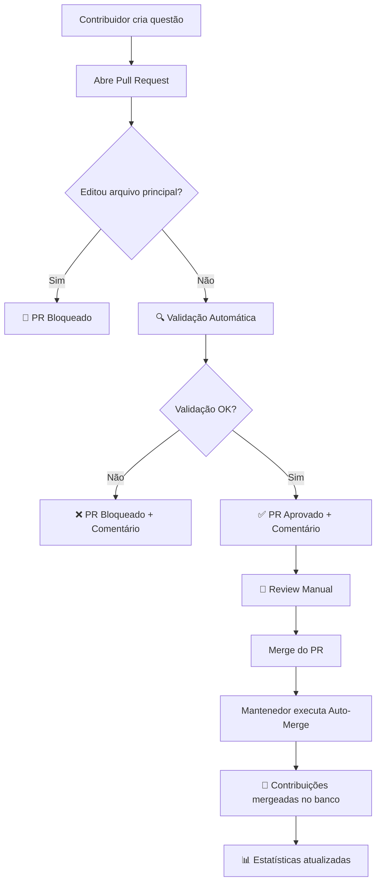

# 🤖 GitHub Actions - CI/CD Workflows

Este diretório contém todos os workflows automatizados do projeto usando GitHub Actions.

## 📋 Workflows Disponíveis

### 1. 🔍 Validate Contributions
**Arquivo**: `workflows/validate-contributions.yml`  
**Trigger**: Pull Requests que modificam arquivos em `data/contributions/`

**O que faz:**
- ✅ Valida automaticamente todas as questões contribuídas
- ✅ Verifica estrutura JSON, campos obrigatórios e tipos de dados
- ✅ Comenta no PR com resultados da validação
- ✅ Bloqueia merge se houver erros

**Como usar:**
Automático! Sempre que você abrir um PR com questões, este workflow executa.

---

### 2. 🚫 Prevent Main File Edits
**Arquivo**: `workflows/prevent-main-file-edits.yml`  
**Trigger**: Pull Requests que tentam editar arquivos principais (`clf-c02.json`, etc.)

**O que faz:**
- 🚫 Bloqueia PRs que editam arquivos principais diretamente
- 💬 Comenta no PR explicando o novo fluxo modular
- 📖 Fornece links para documentação

**Por que existe:**
Evita conflitos de merge forçando o uso do sistema modular de contribuições.

---

### 3. 🔄 Auto-Merge Contributions (Manual)
**Arquivo**: `workflows/auto-merge-contributions.yml`  
**Trigger**: Manual (workflow_dispatch)

**O que faz:**
- 🔄 Mergeia contribuições validadas no arquivo principal
- 💾 Cria backup automático antes do merge
- 🔍 Detecta duplicatas
- 📦 Move contribuições processadas para `_processed/`
- 💾 Faz commit automático das mudanças

**Como usar:**
1. Vá para Actions → Auto-Merge Contributions
2. Clique em "Run workflow"
3. Selecione a certificação (clf-c02, saa-c03, etc.)
4. Escolha dry-run (teste) ou merge real
5. Clique em "Run workflow"

---

### 4. 🧪 Test Python Scripts
**Arquivo**: `workflows/test-python-scripts.yml`  
**Trigger**: Push/PR que modifica scripts Python

**O que faz:**
- 🧪 Testa scripts de validação e merge
- 🐍 Testa em múltiplas versões do Python (3.11, 3.12)
- 🔍 Executa linting com flake8
- ✅ Garante que scripts funcionam corretamente

---

### 5. 📊 Generate Statistics Report
**Arquivo**: `workflows/stats-report.yml`  
**Trigger**: Semanal (segundas-feiras às 9h UTC) ou manual

**O que faz:**
- 📊 Calcula estatísticas do projeto
- 📈 Atualiza badges no README
- 📝 Cria issue semanal com relatório
- 💾 Faz commit das atualizações

---

## 🎯 Fluxo Completo de Contribuição



---

## 🔧 Configuração Local

Para testar os workflows localmente, use [act](https://github.com/nektos/act):

```bash
# Instalar act
brew install act  # macOS
# ou
choco install act  # Windows

# Testar workflow de validação
act pull_request -W .github/workflows/validate-contributions.yml

# Testar workflow de testes
act push -W .github/workflows/test-python-scripts.yml
```

---

## 📝 Templates

### Pull Request Template
**Arquivo**: `PULL_REQUEST_TEMPLATE.md`

Fornece estrutura padrão para PRs com:
- Checklist de validação
- Campos para descrição
- Links para documentação

### Issue Templates

**1. Nova Questão** (`ISSUE_TEMPLATE/nova-questao.md`)
- Template para propor novas questões
- Campos estruturados para facilitar implementação

**2. Bug Report** (`ISSUE_TEMPLATE/bug-report.md`)
- Template para reportar bugs
- Campos para reprodução e ambiente

---

## 🚀 Próximas Melhorias

- [ ] Workflow para deploy automático no GitHub Pages
- [ ] Workflow para geração de changelog automático
- [ ] Workflow para notificação no Discord/Slack
- [ ] Workflow para análise de qualidade de código
- [ ] Workflow para testes E2E com Playwright

---

## 📚 Recursos

- [GitHub Actions Documentation](https://docs.github.com/en/actions)
- [Workflow Syntax](https://docs.github.com/en/actions/using-workflows/workflow-syntax-for-github-actions)
- [GitHub Script Action](https://github.com/actions/github-script)

---

<div align="center">

**Automação construída com ❤️ pela Guilda**

*Menos trabalho manual, mais tempo para aprender!*

</div>
