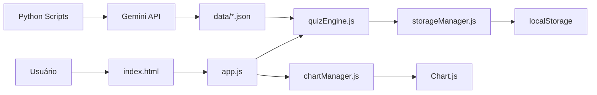

# ☁️ Cloud Certification Study Tool - By Guilda


> **Uma plataforma colaborativa de estudo para certificações AWS, construída pela comunidade, para a comunidade.** Desenvolvida com engenharia moderna, IA generativa e foco em aprendizado prático.

🔗 **[Experimentar Demo Online](https://karlarenatadev.github.io/projeto-simulados-certificacao-aws/)**

---

## 🎯 Visão do Projeto

O **Cloud Certification Study Tool** nasceu da necessidade real de profissionais que buscam certificações AWS de forma eficiente e acessível. Mais do que um simulador, é um **laboratório de engenharia colaborativa** onde desenvolvedores, designers e entusiastas de cloud aprendem juntos através de código aberto.

### Por que este projeto existe?

- 🎓 **Democratizar o acesso** a materiais de estudo de qualidade para certificações AWS
- 🤝 **Criar uma comunidade** de aprendizado colaborativo em cloud computing
- �️ **Praticar engenharia moderna** com arquitetura limpa, IA generativa e PWA
- 📊 **Fornecer insights inteligentes** que vão além de simples pontuações

### O que nos diferencia?

✨ **Questões de múltipla resposta** autênticas ("Escolha 2" ou "Escolha 3")  
🧠 **Sistema de insights com IA** que analisa 11 fatores de desempenho  
📚 **Modo Flashcards 3D** para revisão rápida de conceitos essenciais  
🌐 **Bilíngue (PT-BR/EN-US)** com tradução automática via IA  
📈 **Análise visual avançada** com gráficos de radar e dashboard global  
💾 **100% offline** após instalação como PWA  
🔓 **Código aberto** e extensível para a comunidade

---

## 🏗️ Arquitetura

Este projeto combina o melhor de dois mundos: **front-end vanilla moderno** e **automação inteligente com Python**.

### Front-end: Vanilla JavaScript + ES6 Modules

```
js/
├── app.js              # Orquestrador principal da UI
├── quizEngine.js       # Motor do quiz (lógica de negócio)
├── chartManager.js     # Gráficos Chart.js (radar + dashboard)
├── flashcards.js       # Modo flashcards 3D
├── storageManager.js   # Persistência localStorage
└── data.js             # Dados estáticos (certificações + glossário)
```

**Decisões de Arquitetura:**
- ✅ **Módulos ES6** para separação de responsabilidades
- ✅ **Zero frameworks** para performance máxima e controle total
- ✅ **LocalStorage** com validação robusta e recuperação automática de dados corrompidos
- ✅ **Service Workers** para funcionamento offline completo

### Back-end: Python Scripts + IA Generativa

```
scripts_python/
├── auto_generate_questions.py    # Geração automática via Gemini 2.5 Flash
├── translate_with_api.py         # Tradução PT-BR → EN-US
├── aws_semantic_validator.py     # Validação semântica de questões
├── duplicate_detector.py         # Detecção de duplicatas
├── analyzer.py                   # Análise de qualidade do banco
└── pipeline_runner.py            # Orquestrador do pipeline completo
```

**Decisões de Arquitetura:**
- ✅ **Google Gemini 2.5 Flash** como motor principal de IA
- ✅ **Pydantic V2** para validação de dados e type safety
- ✅ **Deep Translator** para tradução automática com fallback
- ✅ **Pipeline modular** para fácil extensão e manutenção

### Fluxo de Dados



---

## ✨ Funcionalidades Atuais

### 🎓 Simulação Realista de Exames

- **4 Certificações AWS**: CLF-C02, SAA-C03, AIF-C01, DVA-C02
- **728 questões validadas** com explicações detalhadas e links para documentação oficial
- **Questões de múltipla resposta** ("Escolha 2" ou "Escolha 3") como nos exames reais
- **Escala oficial AWS**: Pontuação de 100 a 1000 pontos com selo de aprovação/revisão
- **Dois modos de estudo**:
  - � **Modo Exame**: Timer realista baseado nos tempos oficiais AWS
  - 📖 **Modo Revisão**: Sem pressão de tempo para aprendizado profundo

### 📚 Modo Flashcards 3D

- **96 termos AWS** organizados por certificação
- **Filtro inteligente com separação clara**:
  - 🌐 **Termos Gerais** (7): Conceitos fundamentais para todas certificações
  - ☁️ **Cloud Practitioner** (20): Termos específicos do CLF-C02
  - 🏗️ **Solutions Architect** (27): Termos específicos do SAA-C03
  - 💻 **Developer** (19): Termos específicos do DVA-C02
  - 🤖 **AI Practitioner** (23): Termos específicos do AIF-C01
  - 📚 **Todos** (96): Visualização completa
- **Separação estrita**: Termos gerais aparecem APENAS no filtro "Termos Gerais", cada certificação mostra APENAS seus termos específicos
- **Efeito flip 3D** interativo e responsivo
- Navegação intuitiva (anterior/próximo)
- Contador de progresso visual
- Inicia automaticamente com Termos Gerais

### 📊 Análise Inteligente de Desempenho

- **Gráfico de Radar por Simulado**: Visualize seu desempenho em cada domínio
- **Dashboard Global**: Histórico agregado de todos os simulados na sidebar
- **11 tipos de insights inteligentes**:
  - 🔥 Detecção de sequências de aprovação
  - 📈 Análise de tendências (melhoria/declínio)
  - ⚠️ Alerta de burnout (4+ simulados no mesmo dia)
  - 🎯 Identificação de domínios fracos
  - 📊 Análise de consistência de desempenho
  - 💪 Motivação personalizada baseada em progresso

### 🌐 Experiência Multilíngue

- **Português (PT-BR)** e **Inglês (EN-US)**
- Tradução automática de questões via IA
- Alternância instantânea de idioma
- Interface adaptativa

### 💾 PWA Completo

- **Instalável** em desktop e mobile
- **Funciona 100% offline** após primeira visita
- **Botão de instalação** visível no cabeçalho
- **Ícone personalizado** e splash screen

---

## 🚀 Como Executar Localmente

### Pré-requisitos

- **Navegador moderno** (Chrome, Firefox, Edge, Safari)
- **Servidor HTTP local** (Python, Node.js ou qualquer outro)

### Instalação Rápida

```bash
# 1. Clone o repositório
git clone https://github.com/karlarenatadev/projeto-simulados-certificacao-aws.git
cd projeto-simulados-certificacao-aws

# 2. Inicie um servidor local (escolha um método)

# Opção A: Python 3
python -m http.server 8000

# Opção B: Node.js (npx)
npx http-server -p 8000

# Opção C: PHP
php -S localhost:8000

# 3. Acesse no navegador
# http://localhost:8000
```

### Executar Scripts Python (Opcional)

Se quiser gerar novas questões ou traduzir conteúdo:

```bash
# 1. Instale as dependências Python
cd scripts_python
pip install -r requirements.txt

# 2. Configure sua API Key do Google Gemini
# Crie um arquivo .env na raiz do projeto
echo "GEMINI_API_KEY=sua_chave_aqui" > ../.env

# 3. Gere questões automaticamente
python auto_generate_questions.py clf-c02 --quantity 10

# 4. Traduza para inglês
python translate_with_api.py clf-c02

# 5. Valide a qualidade do banco
python analyzer.py
```

**Obter API Key do Google Gemini:**
1. Acesse [Google AI Studio](https://aistudio.google.com/app/apikey)
2. Crie uma nova API Key
3. Cole no arquivo `.env`

---

## 📊 Certificações Suportadas

| Código | Nome Completo | Questões | Múltipla Resposta | Tradução EN |
|--------|---------------|----------|-------------------|-------------|
| **CLF-C02** | AWS Certified Cloud Practitioner | 195 | ✅ 5 questões | ✅ Completo |
| **SAA-C03** | AWS Certified Solutions Architect - Associate | 195 | 🚧 Em breve | ✅ Completo |
| **AIF-C01** | AWS Certified AI Practitioner | 143 | ✅ 5 questões | 🚧 Pendente |
| **DVA-C02** | AWS Certified Developer - Associate | 195 | 🚧 Em breve | ✅ Completo |

**Total**: 728 questões | 10 questões de múltipla resposta

---

## 🛠️ Stack Tecnológica

### Front-end
- **JavaScript ES6+** - Módulos nativos, async/await, destructuring
- **Tailwind CSS** - Utility-first CSS framework
- **Chart.js** - Gráficos de radar interativos
- **PWA** - Service Workers + Web App Manifest
- **LocalStorage** - Persistência de dados com validação robusta

### Back-end / Automação
- **Python 3.12+** - Scripts de automação e IA
- **Google Gemini 2.5 Flash** - Geração de questões via IA
- **Pydantic V2** - Validação de dados e type safety
- **Deep Translator** - Tradução automática PT-BR → EN-US
- **python-dotenv** - Gerenciamento de variáveis de ambiente

### DevOps / CI-CD
- **GitHub Actions** - 5 workflows automatizados
  - 🔍 Validação automática de contribuições
  - 🚫 Prevenção de edições diretas
  - 🔄 Auto-merge inteligente
  - 🧪 Testes de scripts Python
  - 📊 Relatórios semanais de estatísticas
- **GitHub Pages** - Hospedagem estática
- **Jest** - Testes unitários
- **Webpack** - Bundling (opcional)
- **Git** - Controle de versão

---

## 🤝 Contribua com a Guilda!

Este projeto é **colaborativo por natureza**. Acreditamos que o melhor aprendizado acontece quando construímos juntos.

### Como você pode contribuir?

- 🐛 **Reportar bugs** ou sugerir melhorias via [Issues](https://github.com/karlarenatadev/projeto-simulados-certificacao-aws/issues)
- 💻 **Adicionar novas funcionalidades** (ex: modo adaptativo, exportação Anki)
- 📝 **Criar questões** usando nosso novo sistema modular (sem conflitos de merge!)
- 🎨 **Melhorar a UI/UX** com novas ideias de design
- 🌐 **Traduzir conteúdo** para outros idiomas
- 📚 **Escrever documentação** e tutoriais
- 🧪 **Adicionar testes** unitários e de integração

### 🆕 Novo Fluxo de Contribuição de Questões

Agora você pode contribuir com questões **sem conflitos de merge**! 

```bash
# 1. Copie o template
cp data/contributions/_TEMPLATE.json data/contributions/clf-c02/sua-questao.json

# 2. Preencha sua questão

# 3. Valide
python scripts_python/validate_contribution.py data/contributions/clf-c02/sua-questao.json

# 4. Faça o PR (apenas 1 arquivo!)
```

Cada contribuidor cria seu próprio arquivo individual, eliminando conflitos! 🎉

📖 **[Guia Completo de Contribuição de Questões](./docs/guia-contribuicao-questoes.md)**

### Primeiros Passos

1. Leia nosso **[CONTRIBUTING.md](./CONTRIBUTING.md)** para entender o fluxo de trabalho
2. Procure por issues com a label `good-first-issue` ou `help-wanted`
3. Faça um fork, crie uma branch e envie seu PR
4. Participe das discussões e code reviews

**💡 Dica**: Não precisa ser expert! Contribuições de todos os níveis são bem-vindas. Estamos aqui para aprender juntos.

---

## 📚 Documentação

- 📖 **[Guia Completo](./docs/GUIA-COMPLETO.md)** - Documentação consolidada (usuários e desenvolvedores)
- 🤝 **[Como Contribuir](./CONTRIBUTING.md)** - Guia de contribuição
- 📝 **[CHANGELOG](./CHANGELOG.md)** - Histórico de versões

---

## 📂 Estrutura do Projeto

```text
cloud-certification-study-tool/
│
├── 📁 js/                          # Módulos JavaScript (ES6)
│   ├── app.js                      # Orquestrador principal da UI
│   ├── quizEngine.js               # Motor do quiz (lógica de negócio)
│   ├── chartManager.js             # Gráficos Chart.js
│   ├── flashcards.js               # Modo flashcards 3D
│   ├── storageManager.js           # Persistência localStorage
│   └── data.js                     # Dados estáticos
│
├── 📁 data/                        # Banco de questões JSON
│   ├── clf-c02.json                # Cloud Practitioner (PT-BR)
│   ├── clf-c02-en.json             # Cloud Practitioner (EN-US)
│   ├── saa-c03.json                # Solutions Architect (PT-BR)
│   ├── saa-c03-en.json             # Solutions Architect (EN-US)
│   ├── aif-c01.json                # AI Practitioner (PT-BR)
│   ├── dva-c02.json                # Developer (PT-BR)
│   └── dva-c02-en.json             # Developer (EN-US)
│
├── 📁 scripts_python/              # Pipeline de IA e automação
│   ├── auto_generate_questions.py  # Geração via Gemini
│   ├── translate_with_api.py       # Tradução automática
│   ├── aws_semantic_validator.py   # Validação semântica
│   ├── duplicate_detector.py       # Detecção de duplicatas
│   ├── analyzer.py                 # Análise de qualidade
│   ├── pipeline_runner.py          # Orquestrador completo
│   └── requirements.txt            # Dependências Python
│
├── 📁 docs/                        # Documentação detalhada
│   ├── guia-inicio-rapido.md
│   ├── guia-geracao.md
│   ├── guia-flashcards.md
│   ├── status-traducao.md
│   ├── analise-completa-projeto.md
│   └── resolucao-problemas.md
│
├── 📄 index.html                   # Interface principal
├── 📄 style.css                    # Estilos customizados
├── 📄 sw.js                        # Service Worker (PWA)
├── 📄 manifest.json                # Manifesto PWA
├── 📄 package.json                 # Dependências Node.js
├── 📄 .env.example                 # Exemplo de variáveis de ambiente
├── 📄 CONTRIBUTING.md              # Guia de contribuição
├── 📄 CHANGELOG.md                 # Histórico de versões
└── 📄 README.md                    # Este arquivo
```

---

## 🎯 Roadmap

### v2.1.0 (Abril 2026)
- ✅ Tradução completa AIF-C01 para EN-US
- ✅ +10 questões de múltipla resposta (SAA-C03 e DVA-C02)
- ✅ Expansão do glossário para 30 termos AWS
- ✅ Modo escuro aprimorado para gráficos

### v2.2.0 (Maio 2026)
- 🎯 Marcação de flashcards como "dominados"
- 🎯 Quiz rápido de termos (modo teste de glossário)
- 🎯 Exportação de flashcards para Anki
- 🎯 Filtro por nível de dificuldade (fácil/médio/difícil)

### v3.0.0 (Junho 2026)
- 🚀 Simulados adaptativos (CAT - Computerized Adaptive Testing)
- 🚀 Sistema de autenticação (Firebase Auth)
- 🚀 Sincronização multi-dispositivo
- 🚀 Ranking comunitário (opcional e anônimo)

---

## 👥 Equipe & Comunidade

### Fundadora & Mantenedora Principal

**Karla Renata A. Rosario**  
💼 [LinkedIn](https://www.linkedin.com/in/karlarenata-rosario/) | 🐙 [GitHub](https://github.com/karlarenatadev) | 🌐 [Portfolio](https://karlarenatadev.github.io/projeto-simulados-certificacao-aws/)

### Contribuidores

Este projeto é possível graças à colaboração de desenvolvedores, designers e entusiastas de cloud computing. Veja a lista completa de [contribuidores](https://github.com/karlarenatadev/projeto-simulados-certificacao-aws/graphs/contributors).

**Quer fazer parte da Guilda?** Leia nosso [CONTRIBUTING.md](./CONTRIBUTING.md) e junte-se a nós!

---

## 📝 Licença

Este projeto é **código aberto** e está disponível para fins educacionais e de portfólio técnico.

---

## 🙏 Agradecimentos

- **AWS** pela documentação oficial de alta qualidade
- **Google Gemini** pela API de IA generativa
- **Chart.js** pela biblioteca de gráficos
- **Tailwind CSS** pelo framework CSS
- **Comunidade Open Source** por inspirar e ensinar

---

<div align="center">

### ⭐ Se este projeto foi útil, considere dar uma estrela no GitHub!

**Construído com ❤️ pela Guilda Z-Maguinhos | Aprendizado Colaborativo em Cloud Computing**

<sub>© 2026 Cloud Certification Study Tool - By Guilda | Todos os direitos reservados</sub>

</div>
