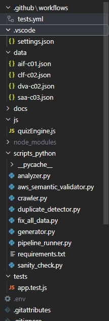
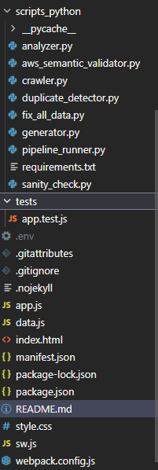

# ☁️ AWS Certification Simulator (AI-Powered ETL)


Uma plataforma de elite para **simulados AWS**, unindo um **Pipeline de Engenharia de Dados autônomo em Python**, **IA Generativa** e um **Frontend Modular de alta performance**. 

Este projeto vai além de um simples quiz web: ele é um ecossistema completo focado em *Data Quality*, *Clean Code* e *Experiência do Usuário (UX)*.

---

## 📑 Índice

[🚀 Visão Geral](#-visão-geral-da-arquitetura) | [⚙️ Engenharia de Dados (Backend)](#-engenharia-de-dados-e-ia-backend) | [💻 Frontend Modular](#-frontend-modular-es6-e-pwa) | [🎯 Funcionalidades](#-funcionalidades-premium) | [🛠 Como Executar](#-como-executar-o-projeto) | [📂 Estrutura](#-estrutura-do-projeto) | [🌐 Demo](#-demo-online) | [📄 Licença](#-licença)

---

## 🚀 Visão Geral da Arquitetura

O projeto é dividido em duas camadas principais que operam de forma desacoplada. Abaixo, podes ver o fluxo de dados no Backend (Python/IA) e a estrutura modular do Frontend (Vanilla JS):

<p align="center">
  
  &nbsp;&nbsp;&nbsp;&nbsp;&nbsp;
  
</p>

1. **A Fábrica de Dados (Python):** Uma esteira ETL (Extract, Transform, Load) que utiliza a API do Google Gemini para gerar questões inéditas, aplicar validações rigorosas de esquema e negócio (semântica AWS) e salvar datasets JSON limpos.
2. **O Consumidor (Vanilla JS):** Um Progressive Web App (PWA) construído com Módulos ES6 que consome esses JSONs. Ele orquestra a lógica do simulado, renderiza gráficos de desempenho e aplica gamificação 100% no lado do cliente (via `localStorage`).

---

## ⚙️ Engenharia de Dados e IA (Backend)

O diferencial deste projeto é a garantia de que nenhuma "alucinação" da IA chegue ao usuário final. O pipeline Python executa em lote e possui 4 camadas de validação:

* **Extract (`generator.py`):** Utiliza **Gemini 1.5 Flash/Pro** com *Prompt Engineering* focado em cenários práticos de negócios (não apenas definições). A saída é forçada para um JSON estruturado através da integração nativa com o **Pydantic V2**.
* **Transform 1 - Schema Enforcement (`sanity_check.py`):** Valida a tipagem de dados, garantindo que a resposta da IA possua exatamente 4 alternativas, um índice de resposta correto válido e justificativas com tamanho mínimo.
* **Transform 2 - Semantic Validation (`aws_semantic_validator.py`):** O "fiscal" de regras de negócio. Ele garante que a resposta correta esteja explícita na justificativa e, crucialmente, impede que a IA insira serviços fora do escopo do exame (ex: reprova a questão se a IA sugerir 'Transit Gateway' num exame 'Cloud Practitioner').
* **Transform 3 - Deduplication (`duplicate_detector.py`):** Utiliza o `SequenceMatcher` nativo do Python para calcular a similaridade (Threshold de 85%) entre a nova questão e o banco existente, impedindo perguntas repetidas.
* **Load (`pipeline_runner.py`):** O orquestrador. Roda o processo em loop para múltiplas certificações (CLF-C02, SAA-C03, etc.), gerenciando o limite de requisições da API (*Rate Limit / 429*) com pausas estratégicas.

---

## 💻 Frontend Modular (ES6) e PWA

A interface do usuário foi refatorada para seguir as melhores práticas de Engenharia de Software no Frontend, eliminando o anti-pattern do "Deus JS" (um arquivo que faz tudo).

* **Arquitetura Desacoplada:** * `quizEngine.js`: O "cérebro" em JavaScript puro. Contém apenas a lógica de negócio (cálculo de pontuação, progressão, embaralhamento), sem nenhuma manipulação de DOM. Totalmente testável.
  * `data.js`: Módulo ES6 que armazena a configuração global, trilhas de exames e mapeamento de domínios oficiais da AWS.
  * `app.js`: O orquestrador de UI (Controller). Apenas importa os módulos, reage às interações do usuário e atualiza o HTML.
* **Experiência PWA:** Instalável em Desktop/Mobile e capaz de funcionar **100% offline** através do cache de Service Workers (`sw.js`).

---

## 🎯 Funcionalidades Premium

* ✅ **Simulação Realista:** Modo Exame (com timer rigoroso) ou Modo Estudo (com justificativas imediatas).
* ✅ **Análise de Desempenho Visual:** Gráficos Radar interativos (*Chart.js*) que mapeiam o conhecimento do usuário frente aos domínios oficiais da AWS (ex: Segurança vs. Faturamento).
* ✅ **Relatórios Históricos:** Geração de relatórios detalhados com sugestões de estudo guiadas por IA com base no domínio mais fraco.
* ✅ **Gamificação:** Sistema de *Streaks* (ofensivas de estudo diário) e Badges de conquista persistidos no navegador.
* ✅ **Design Responsivo:** UI construída com *Tailwind CSS*, com suporte nativo a Dark/Light mode e navegação fluida em dispositivos móveis.

---

## 🛠 Como Executar o Projeto

### 1. Rodando a Aplicação Web (Frontend)
Como o projeto utiliza Módulos ES6 (`import/export`), ele **não pode** ser aberto com um duplo clique no arquivo HTML (devido a políticas de CORS do navegador).
1. Clone o repositório:
   ```bash
   git clone [https://github.com/karlarenatadev/projeto-simulados-certificacao-aws.git](https://github.com/karlarenatadev/projeto-simulados-certificacao-aws.git)
   ```
2. Abra a pasta raiz do projeto no terminal e inicie um servidor local:
   ```bash
   python -m http.server 8000
   ```
3. Acesse `http://localhost:8000` no seu navegador. *(Alternativa: Use a extensão Live Server no VS Code).*

### 2. Alimentando o Banco de Dados com IA (Backend)
1. Certifique-se de ter o Python 3.12+ instalado.
2. Crie um ambiente virtual e instale as dependências:
   ```bash
   pip install google-genai pydantic python-dotenv
   ```
3. Crie um arquivo `.env` na raiz do projeto e adicione sua chave de API do Google Gemini:
   ```text
   GEMINI_API_KEY=sua_chave_de_api_aqui
   ```
4. Execute o Orquestrador do Pipeline para gerar novas questões em lote:
   ```bash
   python scripts_python/pipeline_runner.py
   ```

---

## 📂 Estrutura do Projeto

```text
├── 📂 data/               # Bancos de dados JSON validados (Consumidos pelo Frontend)
├── 📂 js/                 
│   └── quizEngine.js      # Lógica de negócio pura (Classes ES6)
├── 📂 scripts_python/     # Backend: Pipeline de Engenharia de Dados
│   ├── generator.py       # Extração via API do Gemini com Pydantic
│   ├── sanity_check.py    # Validador de Schema (Estrutural)
│   ├── aws_semantic...    # Validador de Negócio (Escopo AWS)
│   ├── duplicate_det...   # Filtro de similaridade de strings
│   └── pipeline_runn...   # Orquestrador do ETL em lote
├── app.js                 # UI Controller (Manipulação de DOM e Eventos)
├── data.js                # Configuração de trilhas e mapeamento de domínios
├── index.html             # Interface principal (Tailwind + FontAwesome)
└── style.css              # Customizações de tema e transições
```

---

## 🌐 Demo Online

Test a plataforma ao vivo, hospedada via **GitHub Pages**:

🔗 **[Acessar o AWS Cloud Simulator](https://karlarenatadev.github.io/projeto-simulados-certificacao-aws/)**

---

## 💡 Dica Final

> "A certificação é o seu destino, a disciplina é o seu motor.
> Pratique até o gráfico de radar estar totalmente preenchido."
> – Karla Renata

---

## 📄 Licença

Projeto **educacional**, desenvolvido por **Karla Renata**. Destinado a portfólio técnico e demonstração de competências avançadas em Engenharia de Dados, Integração com IA e Desenvolvimento Frontend.
