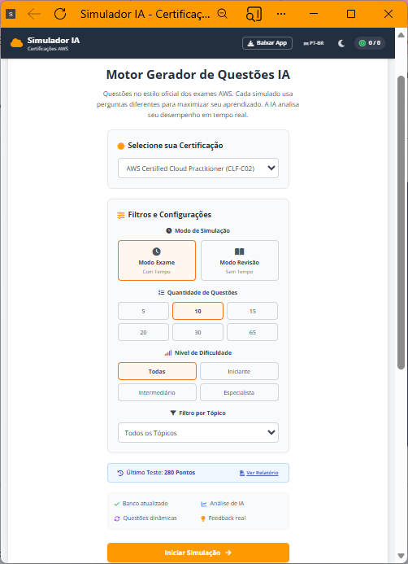
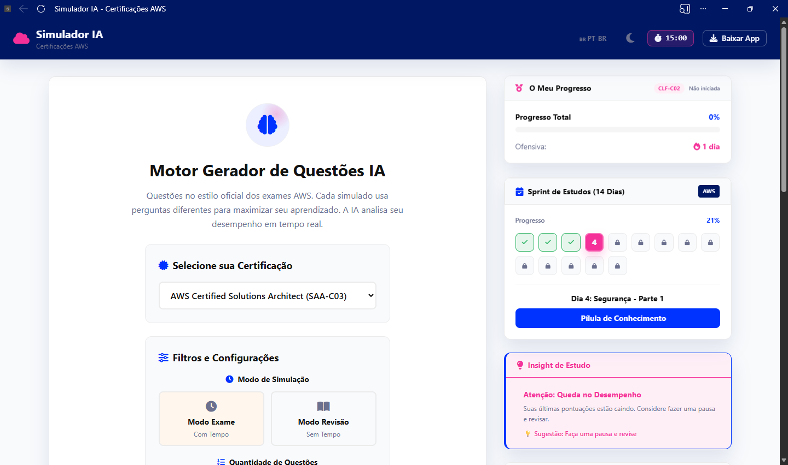
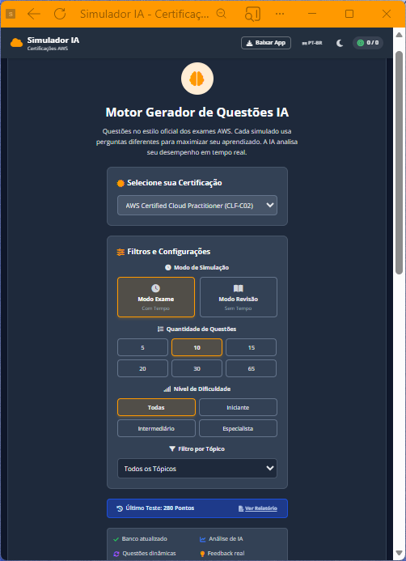
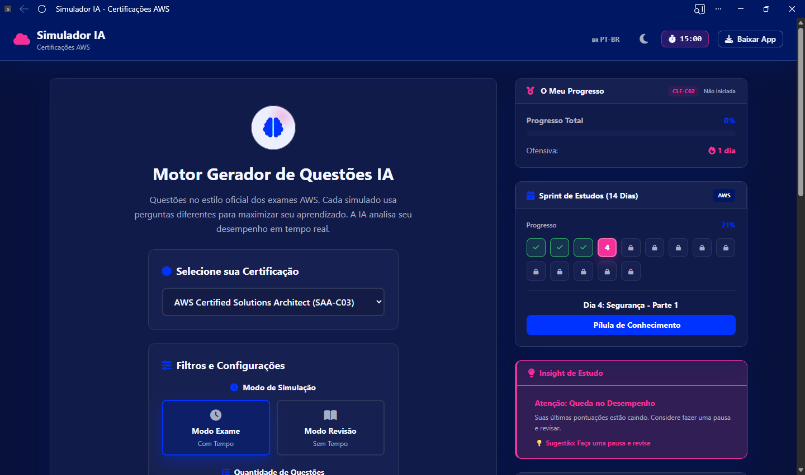
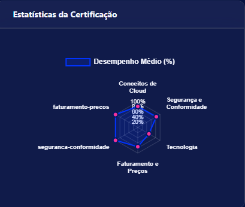
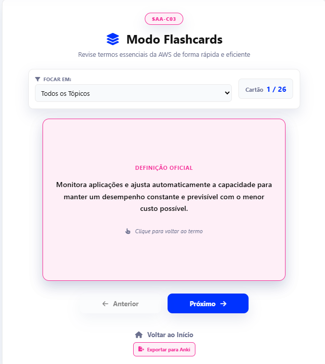
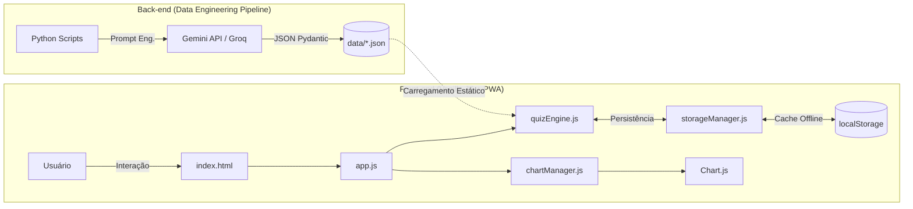

# ☁️ Cloud Certification Study Tool - By Guilda

<div align="center">


[](https://github.com/karlarenatadev/projeto-simulados-certificacao-aws/actions)
[](https://github.com/karlarenatadev/projeto-simulados-certificacao-aws/actions)


**Uma plataforma colaborativa de estudo para certificações AWS, impulsionada por IA Generativa e construída para a comunidade.**

🔗 **[Experimentar Demo Online](https://karlarenatadev.github.io/projeto-simulados-certificacao-aws/)**

</div>

---

## 📸 Conheça a Plataforma

Uma interface moderna, responsiva e focada na experiência de aprendizado profundo.

<div align="center">

| Tela Inicial e Filtros | Simulação Realista (Timer e Múltipla Resposta) |
| :---: | :---: |
|  |  |
|  |  |

| Dashboard e Radar de Desempenho | Modo Flashcards 3D (Revisão Rápida) |
| :---: | :---: |
|  |  |

</div>

---

## 🎯 A Visão do Projeto

O **Cloud Certification Study Tool** vai além de um simulador tradicional. É um **laboratório de engenharia de software e dados** open-source, criado para democratizar o acesso a materiais de estudo de alta qualidade. 

Através da combinação de um front-end moderno (PWA) e um back-end automatizado por Inteligência Artificial, oferecemos uma experiência de aprendizado adaptativa, offline-first e baseada em dados reais de arquitetura Cloud.

### Diferenciais Técnicos e Educacionais:
* 🧠 **Banco de Dados Dinâmico:** Questões inéditas e cenários corporativos gerados via *Google Gemini 2.5 Flash*, com **fallback resiliente via Groq (llama-3.3-70b-versatile)** para garantir 100% de disponibilidade na geração.
* 📊 **Análise Comportamental:** O sistema avalia seu desempenho usando 11 métricas de IA (burnout, domínios fracos, consistência).
* 💾 **100% Offline (PWA):** Estude no metrô ou no avião. O app funciona sem internet após o primeiro acesso.
* 🌐 **Bilíngue Automatizado:** Suporte nativo a Português e Inglês com tradução neural.

---

## 🏗️ Arquitetura e Engenharia de Dados

O projeto utiliza uma arquitetura limpa (*Clean Architecture*), separando completamente a interface de usuário da esteira pesada de geração de dados.

### 🔄 Fluxo de Dados e Integrações

O diagrama abaixo ilustra como nossos scripts Python alimentam o banco de dados consumido pelo Front-end:



### ⚙️ Pipeline ETL (A Fábrica de Questões)
O coração do simulador é uma esteira automatizada em **Python 3.12+**:
1. **Extract:** O `generator.py` orquestra chamadas às APIs de IA para gerar cenários complexos.
2. **Transform (Schema):** Validação estrita de tipagem via **Pydantic V2**.
3. **Transform (Semântica):** O `aws_semantic_validator.py` filtra pegadinhas fracas e linguagem engessada.
4. **Transform (Dedup):** Algoritmo inteligente que barra a entrada de questões repetidas.
5. **Load:** Os JSONs são estruturados e entregues diretamente à pasta `data/` do Front-end.

---

## 📊 Volume de Dados e Certificações

Nosso banco de dados está em expansão contínua através da automação. Possuímos um volume de dados comparável a plataformas comerciais.

| Código | Certificação | Volume Atual | Múltipla Resposta | Idiomas |
|--------|--------------|--------------|-------------------|---------|
| **CLF-C02** | AWS Certified Cloud Practitioner | ~660 | ✅ Suportado | 🇧🇷 PT / 🇺🇸 EN |
| **SAA-C03** | AWS Certified Solutions Architect | ~380 | ✅ Suportado | 🇧🇷 PT / 🇺🇸 EN |
| **DVA-C02** | AWS Certified Developer | ~400 | ✅ Suportado | 🇧🇷 PT / 🇺🇸 EN |
| **AIF-C01** | AWS Certified AI Practitioner | ~510 | ✅ Suportado | 🇧🇷 PT / 🇺🇸 EN |

🚀 **Total Consolidado:** **1.964 questões** geradas, auditadas e traduzidas por IA.

---

## 🚀 Como Executar Localmente

### 1. Rodando a Aplicação (Front-end)
Sem build, sem complicação. É só clonar e servir:
```bash
# Clone o repositório
git clone [https://github.com/karlarenatadev/projeto-simulados-certificacao-aws.git](https://github.com/karlarenatadev/projeto-simulados-certificacao-aws.git)
cd projeto-simulados-certificacao-aws

# Inicie um servidor local (Exemplo com Python)
python -m http.server 8000

# Acesse no navegador: http://localhost:8000
```

### 2. Executando o Pipeline de IA (Back-end)
Caso queira atuar como Engenheiro de Dados do projeto e gerar novos lotes:
```bash
cd scripts_python
pip install -r requirements.txt

# Crie seu arquivo .env com a chave da API do Google Gemini
echo "GEMINI_API_KEY=sua_chave_aqui" > ../.env

# Execute a Auditoria Geral do Banco de Dados
python auditoria_geral.py

# Execute o Pipeline de Geração para um exame específico
python auto_generate_questions.py clf-c02 --quantity 10
```

---

## 🤝 Contribua com a Guilda!

Somos um projeto **Open-Source** e colaborativo. Se você está estudando para AWS ou quer praticar suas habilidades de desenvolvimento, junte-se a nós!

### 🆕 Fluxo Moderno de Contribuição (Sem Merge Conflicts)
Você pode adicionar novas questões criando um arquivo único. Sem dores de cabeça com conflitos de Git!

1. **Copie o template:**
   ```bash
   cp data/contributions/_TEMPLATE.json data/contributions/clf-c02/sua-questao.json
   ```
2. **Preencha** o cenário corporativo e as opções.
3. **Valide localmente:**
   ```bash
   python scripts_python/validate_contribution.py data/contributions/clf-c02/sua-questao.json
   ```
4. **Abra o Pull Request!** Nossos GitHub Actions farão o resto do trabalho.

📖 Leia nosso **[Guia Completo de Contribuição](./CONTRIBUTING.md)** para mais detalhes.

---

## 🎯 Roadmap 2026

- [x] Expansão do banco para quase 2.000 questões.
- [x] Integração da nova certificação AIF-C01 (AI Practitioner).
- [ ] Exportação de flashcards para Anki.
- [ ] Implementação de Testes Adaptativos (CAT - Computerized Adaptive Testing).
- [ ] Ranking Comunitário anônimo.

---

## 👥 Equipe & Liderança

O sucesso deste simulador é fruto de um trabalho colaborativo focado em excelência pedagógica e técnica:

* **Karla Renata Rosario** — *Fundadora & Desenvolvedora Principal* 💼 [LinkedIn](https://www.linkedin.com/in/karlarenata-rosario/) | 🐙 [GitHub](https://github.com/karlarenatadev) | 🌐 [Portfólio](https://karlarenatadev.github.io/portfolio-karla-renata/)
* **Amanda Veras** — *Idealizadora & Avaliadora*
* **Otto Jacometo** — *Orientador & Desenvolvedor*

Agradecimento especial a todos os contribuidores da comunidade que ajudam a manter este projeto vivo.

<br>
<div align="center">

⭐ **Se este projeto ajudou nos seus estudos, considere deixar uma estrela no repositório!** ⭐

*Construído com ❤️ pela Guilda Z-Maguinhos | Aprendizado Colaborativo em Cloud Computing*

</div>
