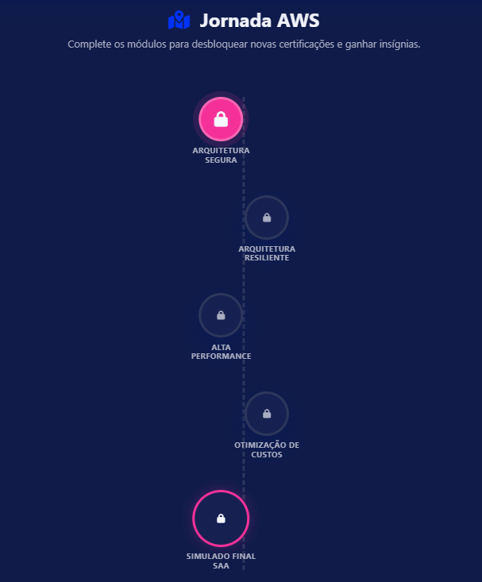
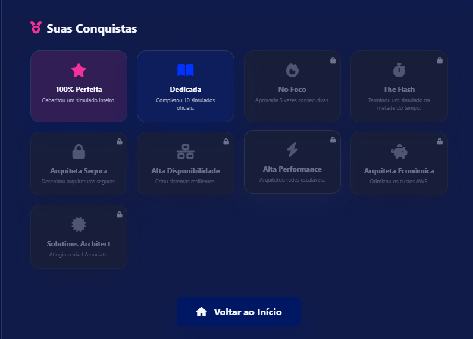
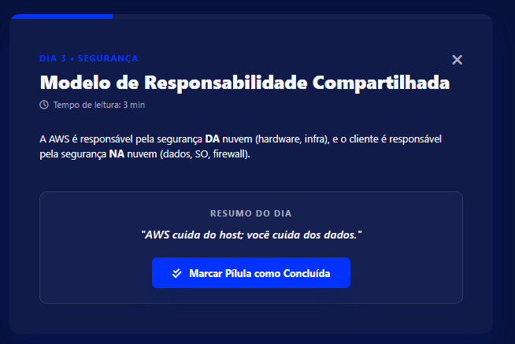
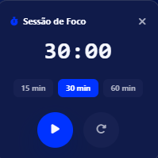

# ☁️ Simulador de Certificação AWS


Um **simulador de estudos para certificações AWS**, focado em prática real, diagnóstico de desempenho,
trilha gamificada, revisão e evolução contínua. O projeto é desenvolvido de forma **colaborativa** pela
**Guilda dos Estagiários da A3Data** e funciona como SPA/PWA leve, com fallback offline e uma API local
opcional.

> Projeto educacional independente, **sem afiliação oficial com a AWS**.

---

## 🔭 Visão geral

Estudar para certificações AWS costuma esbarrar em dois problemas: material disperso e falta de feedback
sobre onde você ainda está fraco. Este simulador resolve isso reunindo, em um só lugar:

- **prática** com simulados por certificação;
- **mensuração** do desempenho por domínio;
- **revisão** com flashcards e (em evolução) revisão de erros;
- **constância** com trilha gamificada e Pomodoro de foco.

**Para quem é:** pessoas estudando para certificações AWS (do Cloud Practitioner ao nível Associate) que
querem praticar e acompanhar evolução de forma objetiva.

**Por que é colaborativo:** além de ajudar quem estuda, o projeto serve como laboratório técnico da Guilda —
reunindo frontend, backend, banco local, testes, automações e curadoria de dados, com backlog organizado e
revisão por pull request.

---

## ⭐ Destaques do projeto

- 🎯 Simulados por certificação, com questões organizadas por **domínio** e **subdomínio**.
- 🧭 Suporte a **múltiplas certificações** AWS (CLF-C02, SAA-C03, DVA-C02, AIF-C01).
- 🧪 **Diagnóstico** de nivelamento que identifica domínios fracos.
- 🗺️ **Trilha gamificada** de estudos (conteúdo em expansão).
- ⏱️ **Pomodoro** de foco com duração selecionável (15/30/60 min).
- 🏷️ **Badge** da certificação ativa no painel de progresso.
- 📊 **Dashboard** com gráficos de desempenho e relatório em **PDF**.
- 🃏 **Flashcards** para revisão de conceitos.
- 🌗 **Tema claro/escuro** e **idiomas PT/EN**.
- 📴 **PWA** com fallback offline por JSON/`localStorage`.
- 🗄️ Base preparada para evolução com **API Express + banco PGlite**.
- 📋 Documentação técnica e backlog organizados (auditoria de épicos/tasks + GitHub Projects).

---

## 🖼️ Demonstração visual

> Prints reais do projeto (pasta `img/`). As variações *dark* mostram o tema escuro.

### Tela inicial

| Claro | Escuro |
| --- | --- |
|  |  |

### Dashboard de desempenho


### Flashcards


### Trilha Gamificada 



### Badges



### Sprint de 14 dias



### Pomodoro (15 - 30 - 60 min)



> Prints de **trilha gamificada**, **Pomodoro** e **diagnóstico** ainda não estão disponíveis na pasta de
> imagens e podem ser adicionados em uma próxima atualização.

---

## 🧩 Funcionalidades

### ✅ Já disponíveis

| Funcionalidade | Status |
| --- | --- |
| Seleção de certificação (CLF/SAA/DVA/AIF) | Funcional |
| Execução de simulados | Funcional |
| Correção de respostas e pontuação | Funcional |
| Teste diagnóstico (nivelamento) | Funcional |
| Flashcards de revisão | Funcional |
| Dashboard com gráficos por domínio | Funcional |
| Relatório em PDF | Funcional |
| Pomodoro com opções 15/30/60 min | Funcional |
| Badge da certificação ativa | Funcional |
| Status da trilha calculado pelo progresso | Funcional |
| Histórico local de progresso | Funcional |
| Tema claro/escuro | Funcional |
| Idiomas PT/EN | Funcional |
| PWA + fallback offline (JSON/`localStorage`) | Funcional |
| API Express local | Funcional |
| Seed dos JSONs para PGlite | Funcional |
| Painel de validação de questões | Funcional |
| Testes automatizados (Jest) | Funcional |

### 🔧 Em evolução

| Funcionalidade | Situação |
| --- | --- |
| Revisão de erros (usar erros reais do usuário) | Em evolução — hoje há estado/mensagem amigável; fluxo completo planejado |
| Diagnóstico personalizado (gerar simulado dos domínios fracos) | Em evolução — diagnóstico calcula domínios fracos, geração do simulado ainda planejada |
| Persistência com backend (reduzir dependência de `localStorage`) | Em integração — tabelas existem, uso no fluxo principal em andamento |
| Expansão da trilha/sprint de estudos (dias 4–14) | Em evolução — conteúdo inicial cadastrado |
| Governança do dataset de questões (`certification`, `validation_status`, `review_type` nos JSONs) | Planejado — schema documentado, campos ainda não aplicados em massa |

### 🧱 Próximos passos (backlog)

- Implementar a revisão de erros com base nas questões realmente erradas.
- Converter o diagnóstico em plano de estudo personalizado e registrar histórico.
- Definir estratégia de persistência (local-first vs backend-first) e ativar as tabelas existentes.
- Expandir o conteúdo da sprint de estudos e a evolução visual da trilha.
- Padronizar a curadoria do banco de questões (campos de governança e separação validadas/pendentes/rejeitadas).

> O detalhamento de épicos, tasks e priorização é mantido em backlog (auditoria de épicos/tasks e GitHub
> Projects). Veja também [docs/EPICOS-E-TASKS.md](docs/EPICOS-E-TASKS.md).

---

## 🧭 Evolução do projeto

O projeto amadureceu de forma incremental e colaborativa:

1. **Base de simulados** — começou como um motor de quiz por certificação, com questões versionadas em JSON.
2. **Trilha gamificada** — evoluiu para uma jornada de estudos com módulos e progresso.
3. **Foco e experiência** — recebeu Pomodoro, flashcards, dashboard, relatório em PDF e suporte PT/EN.
4. **Auditoria técnica** — passou por uma auditoria dos épicos/tasks, comparando o que era prometido com o
   que estava realmente implementado.
5. **Organização do backlog** — os gaps viraram épicos, tasks e cards prontos para o GitHub Projects.
6. **Evolução por quick wins** — segue avançando em pequenas entregas validadas (build + testes + lint),
   issues e revisão colaborativa por pull request.

A proposta não é parecer "100% pronto", e sim mostrar **maturidade de processo**: o que funciona está claro,
e o que está em evolução está sinalizado de forma honesta.

---

## 🏗️ Arquitetura resumida

```text
data/                  # bases de questões e diagnósticos (JSON versionado)
src/frontend/          # fonte principal do frontend (JS, estilos)
src/services/          # cliente HTTP da API
src/python/scripts/    # automações (validação, tradução, geração)
public/                # artefato servido/buildado (SPA/PWA)
backend/               # API Express + banco PGlite (schema, seed, normalizadores)
docs/                  # documentação técnica e backlog
validation/            # painel interno de validação de questões
img/                   # prints do projeto
.github/               # workflows (CI/CD) e templates
__tests__/             # testes Jest
```

Pontos importantes sobre as fontes de verdade:

- **`src/frontend/js` é a fonte de verdade do JavaScript.**
- **`public/js` é gerado pelo build** (`npm run build` copia `src/frontend` e `data/` para `public/`).
- **`public/index.html` é a fonte do HTML** (não é gerado pelo build).

A aplicação prioriza resiliência: se a API não estiver disponível, o frontend continua funcionando com os
dados JSON e o `localStorage`.

---

## 🛠️ Tecnologias utilizadas

| Camada | Tecnologia |
| --- | --- |
| Frontend | HTML, CSS e JavaScript Vanilla |
| SPA/PWA | `manifest.json`, service worker e `localStorage` |
| Backend | Node.js + Express |
| Banco local | PGlite (PostgreSQL embarcado) |
| Dados | JSON versionado |
| Automação | Python 3.12+ |
| Testes | Jest |
| Build | Scripts Node (`scripts/build.cjs`) |
| Servidor local | live-server |
| CI/CD | GitHub Actions (+ GitHub Pages) |

---

## ▶️ Como rodar localmente

Pré-requisitos: **Node.js 18+**, **npm**, **Git** (e **Python 3.12+** apenas para as automações em
`src/python/scripts/`).

### 1. Instalar dependências

```bash
npm install
```

### 2. Configurar variáveis de ambiente

```bash
cp .env.example .env
```

No Windows (PowerShell):

```powershell
Copy-Item .env.example .env
```

Exemplo mínimo de `.env` para desenvolvimento:

```ini
NODE_ENV=development
DB_DATA_DIR=.pglite-data
PORT=3001
```

> O `.env` é local e **não** deve ser commitado. Fora de `NODE_ENV=test`, `DB_DATA_DIR` é obrigatório.

### 3. Rodar apenas o frontend (com fallback por JSON/localStorage)

```bash
npm run dev
```

O comando executa o build e serve a pasta `public/`. Acesse a URL exibida no terminal, normalmente:

```text
http://127.0.0.1:8080
```

### 4. Rodar o app completo (frontend + API + banco)

Prepare o banco local e use dois terminais:

```bash
npm run db:seed
```

```bash
# Terminal 1 — API Express
npm run api:start
# Health check: http://127.0.0.1:3001/api/health
```

```bash
# Terminal 2 — Frontend
npm run dev
```

### Comandos disponíveis

| Comando | Descrição |
| --- | --- |
| `npm run dev` | Build + servidor local em `public/` |
| `npm run build` | Copia `src/frontend` e `data/` para `public/` |
| `npm test` | Executa a suíte Jest |
| `npm test -- --runInBand` | Executa os testes em série |
| `npm run lint` | Verifica o JavaScript do frontend |
| `npm run format` | Formata os arquivos (Prettier) |
| `npm run format:check` | Verifica a formatação |
| `npm run db:seed` | Popula o PGlite com os JSONs principais |
| `npm run api:start` | Inicia a API Express |
| `npm run db:start` | Inicializa a camada de banco (modo demonstrativo) |

> Observação: este projeto **não** possui `npm start`. Para subir a interface, use `npm run dev`.

---

## 🗄️ Dados, API e PWA (detalhes técnicos)

### Dados e certificações

A base principal está versionada em `data/` (JSON). Certificações contempladas:

| Certificação | Código |
| --- | --- |
| AWS Certified Cloud Practitioner | CLF-C02 |
| AWS Certified Solutions Architect Associate | SAA-C03 |
| AWS Certified Developer Associate | DVA-C02 |
| AWS Certified AI Practitioner | AIF-C01 |

Os dados alimentam dois fluxos: **frontend offline/fallback** (consome os JSONs diretamente) e **banco
PGlite** (populado via seed).

### API Express

Localizada em `backend/api/server.js`, oferece endpoints para questões, quiz, usuários, estatísticas,
domínios fracos, leaderboard e validação de questões. Health check local:

```text
http://127.0.0.1:3001/api/health
```

Contratos de rotas: [docs/ROUTES_AND_INTEGRATIONS.md](docs/ROUTES_AND_INTEGRATIONS.md).

### Banco PGlite

A camada de banco fica em `backend/database/` (schema, normalizadores, seed e testes). Para popular:

```bash
npm run db:seed
```

Setup detalhado: [docs/PGLITE_SETUP.md](docs/PGLITE_SETUP.md).

### Validação de questões

Fluxo interno de curadoria com status `PENDING`, `APPROVED` e `REJECTED`, com painel em `validation/`
integrado aos endpoints Express.

### PWA e offline

Suporte a PWA via `public/manifest.json` e `public/sw.js`. Sem API ativa, o app usa os JSONs versionados e o
`localStorage`, permitindo estudar offline.

---

## 🧪 Qualidade e validação

O projeto adota práticas para sustentar a evolução com segurança:

- ✅ **Testes automatizados** com Jest (`npm test`).
- 🧹 **Lint** do frontend (`npm run lint`).
- 🎨 **Format check** com Prettier (`npm run format:check`).
- 🏗️ **Build** reprodutível (`npm run build`).
- 🤖 **GitHub Actions** (CI) — ver badge no topo e `.github/workflows/`.
- 🔍 **Auditoria de épicos/tasks** e **backlog no GitHub Projects** para rastrear gaps.

Verificação recomendada antes de abrir um pull request:

```bash
npm test -- --runInBand
npm run lint
npm run format:check
npm run build
```

---

## 🤝 Como contribuir

Contribuições são muito bem-vindas — este é um projeto colaborativo. Você pode ajudar com:

- novas questões e revisão de questões;
- melhorias de UI/UX;
- testes e documentação;
- correção de bugs;
- evolução da trilha gamificada;
- expansão de certificações.

Fluxo simples:

1. Crie uma branch específica para sua alteração.
2. Faça uma alteração pequena e focada.
3. Rode os testes e as verificações.
4. Abra um Pull Request descrevendo o que foi feito.
5. Aguarde a revisão colaborativa.

```bash
git checkout -b feat/nome-da-melhoria
npm test
npm run lint
npm run format:check
```

Guia completo de contribuição: [docs/CONTRIBUTING.md](docs/CONTRIBUTING.md).

> Evite commitar arquivos locais, logs, `.env` ou dados gerados.

---

## 🗺️ Roadmap

### Fase 1 — MVP funcional
Simulados por certificação, correção e pontuação, flashcards, suporte PT/EN. **(entregue)**

### Fase 2 — Experiência de estudo
Trilha gamificada, Pomodoro (15/30/60), badge de certificação, dashboard e progresso. **(entregue / em evolução)**

### Fase 3 — Diagnóstico e revisão inteligente
Revisão de erros com erros reais e diagnóstico que gera simulado personalizado. **(em evolução)**

### Fase 4 — Governança e dados
Campos de governança no dataset (`certification`, `validation_status`, `review_type`), validação e curadoria. **(planejado)**

### Fase 5 — Integração e persistência
Persistência com backend, histórico, progresso sincronizado e analytics. **(em integração)**

Roadmap completo: [docs/roadmap.md](docs/roadmap.md).

---

## 📊 Status atual

| Área | Status |
| --- | --- |
| Simulados | Funcional |
| Flashcards | Funcional |
| Pomodoro (15/30/60) | Funcional |
| Badge de certificação | Funcional |
| Dashboard e gráficos | Funcional |
| Relatório PDF | Funcional |
| Trilha gamificada | Funcional (conteúdo em expansão) |
| Diagnóstico | Parcial / em evolução |
| Revisão de erros | Em evolução |
| Backend / persistência | Em integração |
| Dataset de questões | Em curadoria |
| Idiomas PT/EN | Funcional |

---

## 🧯 Problemas comuns

- **A API não inicia:** confirme que o `.env` existe com `DB_DATA_DIR=.pglite-data` e `PORT=3001`, e que a
  porta `3001` está livre.
- **O frontend abre, mas não carrega dados da API:** verifique o health check
  (`http://127.0.0.1:3001/api/health`). Sem API, o app deve usar o fallback por JSON/`localStorage`.
- **O banco não foi populado:** rode novamente `npm run db:seed`.
- **Testes instáveis:** rode em série com `npm test -- --runInBand`.

---

## 📚 Documentação

- [Arquitetura](docs/ARCHITECTURE.md)
- [Checklist](docs/CHECKLIST.md)
- [Épicos e Tasks](docs/EPICOS-E-TASKS.md)
- [Rotas e Integrações](docs/ROUTES_AND_INTEGRATIONS.md)
- [PGlite Setup](docs/PGLITE_SETUP.md)
- [Roadmap](docs/roadmap.md)
- [Guia de Contribuição](docs/CONTRIBUTING.md)

---

## 📄 Licença

Distribuído sob a licença **MIT** (conforme badge e este README).

> ⚠️ Atenção: há divergência a alinhar — o `package.json` declara `ISC` e o arquivo `LICENSE` ainda não
> existe na raiz. Recomenda-se padronizar a licença e adicionar o arquivo `LICENSE` correspondente.

---

## 👥 Créditos

Projeto desenvolvido de forma colaborativa pela **Guilda dos Estagiários da A3Data**, com foco em aprendizado
prático, certificações cloud, engenharia de software e evolução técnica contínua.
