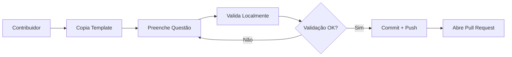
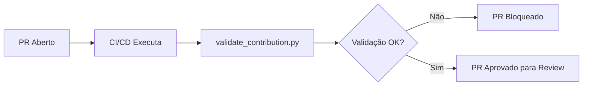
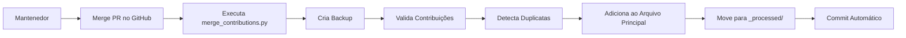

# 🏗️ Arquitetura do Sistema de Contribuições Modulares

## 📋 Visão Geral

Este documento descreve a arquitetura do sistema de contribuições modulares que elimina conflitos de merge no Git quando múltiplos contribuidores adicionam questões simultaneamente.

---

## 🎯 Problema Original

### Cenário Antigo (Arquivos Monolíticos)

```
❌ PROBLEMA: Conflitos de Merge Massivos

Contribuidor A:                    Contribuidor B:
├─ Edita clf-c02.json             ├─ Edita clf-c02.json
├─ Adiciona questão na linha 500  ├─ Adiciona questão na linha 500
├─ Faz commit                      ├─ Faz commit
└─ Abre PR #1                      └─ Abre PR #2
                                      ❌ CONFLITO!

Resultado:
- PR #2 bloqueado até merge de PR #1
- Contribuidor B precisa resolver conflitos manualmente
- Perda de tempo e frustração
- Desestímulo à contribuição
```

### Impacto

- ⏱️ **Tempo perdido**: Horas resolvendo conflitos
- 😤 **Frustração**: Contribuidores desistem
- 🐛 **Erros**: Conflitos mal resolvidos introduzem bugs
- 📉 **Escalabilidade**: Não funciona com muitos contribuidores

---

## ✅ Solução: Sistema Modular

### Arquitetura Nova

```
✅ SOLUÇÃO: Arquivos Individuais

Contribuidor A:                    Contribuidor B:
├─ Cria questao-s3-versioning.json ├─ Cria questao-iam-roles.json
├─ Faz commit                      ├─ Faz commit
└─ Abre PR #1 ✅                   └─ Abre PR #2 ✅
                                      ✅ SEM CONFLITO!

Resultado:
- PRs independentes e paralelos
- Zero conflitos de merge
- Merge automático via script
- Contribuições rápidas e fáceis
```

---

## 🏗️ Estrutura de Diretórios

```
data/
├── contributions/                    # 🆕 Pasta de contribuições modulares
│   ├── README.md                    # Guia rápido para contribuidores
│   ├── _TEMPLATE.json               # Template para escolha única
│   ├── _TEMPLATE_MULTIPLE_ANSWER.json  # Template para múltipla resposta
│   │
│   ├── clf-c02/                     # Cloud Practitioner
│   │   ├── .gitkeep
│   │   ├── questao-s3-versioning.json      # Contribuição A
│   │   ├── questao-iam-roles.json          # Contribuição B
│   │   ├── questao-ec2-types.json          # Contribuição C
│   │   └── _processed/              # Questões já mergeadas
│   │       └── questao-s3-versioning_20260324_143022.json
│   │
│   ├── saa-c03/                     # Solutions Architect
│   │   ├── .gitkeep
│   │   └── questao-vpc-subnets.json
│   │
│   ├── aif-c01/                     # AI Practitioner
│   │   ├── .gitkeep
│   │   └── questao-sagemaker.json
│   │
│   └── dva-c02/                     # Developer
│       ├── .gitkeep
│       └── questao-lambda-layers.json
│
├── backups/                         # Backups automáticos
│   ├── clf-c02_backup_20260324_143022.json
│   └── saa-c03_backup_20260324_150000.json
│
├── clf-c02.json                     # ⚠️ Arquivo principal (não editar manualmente)
├── saa-c03.json                     # ⚠️ Arquivo principal (não editar manualmente)
├── aif-c01.json                     # ⚠️ Arquivo principal (não editar manualmente)
└── dva-c02.json                     # ⚠️ Arquivo principal (não editar manualmente)
```

---

## 🔄 Fluxo de Dados

### 1. Contribuição (Contribuidor)



### 2. Validação (Automática)



### 3. Merge (Mantenedor)



---

## 🛠️ Componentes do Sistema

### 1. Templates

**Propósito**: Fornecer estrutura padrão para questões

**Arquivos**:
- `_TEMPLATE.json` - Questões de escolha única
- `_TEMPLATE_MULTIPLE_ANSWER.json` - Questões de múltipla resposta

**Campos**:
```json
{
  "domain": "string",           // Domínio da certificação
  "subdomain": "string",        // Subdomínio específico
  "service": "string",          // Serviço AWS
  "difficulty": "easy|medium|hard",
  "type": "multiple-choice|multiple-answer",
  "tags": ["array", "de", "strings"],
  "question": "string",         // Texto da questão
  "options": ["array", "de", "4", "opcoes"],
  "correct": 0 | [0, 2],       // Índice ou array de índices
  "explanation": "string",      // Explicação detalhada
  "reference": "url",           // Link para docs AWS
  "contributor": {              // Informações do contribuidor
    "name": "string",
    "github": "string",
    "date": "YYYY-MM-DD"
  }
}
```

### 2. Validador (`validate_contribution.py`)

**Propósito**: Validar questões antes do merge

**Validações**:
- ✅ Estrutura JSON válida
- ✅ Campos obrigatórios presentes
- ✅ Tipos de dados corretos
- ✅ Domínio válido para certificação
- ✅ Dificuldade válida (easy/medium/hard)
- ✅ Tipo válido (multiple-choice/multiple-answer)
- ✅ Exatamente 4 opções
- ✅ Resposta correta dentro do range
- ✅ Tags relevantes (mínimo 2)
- ✅ Questão com tamanho adequado (50-1000 chars)
- ✅ Explicação detalhada (50-1000 chars)
- ✅ Informações do contribuidor completas

**Uso**:
```bash
python scripts_python/validate_contribution.py \
  data/contributions/clf-c02/questao-s3.json
```

**Saída**:
```
🔍 Validando: questao-s3.json
============================================================

✅ VALIDAÇÃO PASSOU!
   Sua questão está pronta para ser submetida via Pull Request!
```

### 3. Merger (`merge_contributions.py`)

**Propósito**: Consolidar contribuições no arquivo principal

**Funcionalidades**:
- 📂 Carrega arquivo principal
- 💾 Cria backup automático
- 🔍 Valida cada contribuição
- 🔄 Detecta duplicatas (texto exato + similaridade)
- ➕ Adiciona ao banco principal
- 📦 Move para pasta `_processed/`
- 💾 Salva arquivo atualizado

**Uso**:
```bash
# Merge real
python scripts_python/merge_contributions.py clf-c02

# Dry-run (teste sem alterar arquivos)
python scripts_python/merge_contributions.py clf-c02 --dry-run
```

**Saída**:
```
🔄 Mergeando contribuições para: clf-c02
============================================================
💾 Backup criado: clf-c02_backup_20260324_143022.json
📂 Arquivo principal carregado: 195 questões
📥 Contribuições encontradas: 3

🔍 Processando: questao-s3-versioning.json
   ✅ Mergeada com sucesso! Movida para _processed/

🔍 Processando: questao-iam-roles.json
   ✅ Mergeada com sucesso! Movida para _processed/

🔍 Processando: questao-ec2-duplicate.json
   ⚠️  Questão duplicada detectada. Pulando...

============================================================
📊 RESULTADOS DO MERGE
============================================================
✅ Questões mergeadas: 2
⚠️  Questões puladas: 1
❌ Erros: 0

💾 Arquivo principal atualizado: 197 questões totais
```

---

## 🔒 Segurança e Qualidade

### Detecção de Duplicatas

**Método 1: Comparação Exata**
```python
if question_text.lower() == existing_text.lower():
    return True  # Duplicata exata
```

**Método 2: Similaridade (opcional)**
```python
from string_similarity import similarity
if similarity(question_text, existing_text) > 0.9:
    return True  # 90%+ similar
```

### Backups Automáticos

Antes de cada merge, o sistema cria backup:
```
data/backups/clf-c02_backup_20260324_143022.json
```

Formato: `{cert-id}_backup_{timestamp}.json`

### Validação em Múltiplas Camadas

1. **Local** (Contribuidor): `validate_contribution.py`
2. **CI/CD** (GitHub Actions): Validação automática no PR
3. **Merge** (Mantenedor): Validação antes de adicionar ao banco

---

## 📊 Métricas e Monitoramento

### Estatísticas de Contribuição

```bash
# Contribuições pendentes
ls data/contributions/clf-c02/*.json | wc -l

# Contribuições processadas
ls data/contributions/clf-c02/_processed/*.json | wc -l

# Total de questões no banco
jq '. | length' data/clf-c02.json
```

### Análise de Qualidade

```bash
# Questões por dificuldade
jq '[.[] | .difficulty] | group_by(.) | map({key: .[0], count: length})' data/clf-c02.json

# Questões por domínio
jq '[.[] | .domain] | group_by(.) | map({key: .[0], count: length})' data/clf-c02.json

# Questões de múltipla resposta
jq '[.[] | select(.type == "multiple-answer")] | length' data/clf-c02.json
```

---

## 🚀 Escalabilidade

### Suporta Crescimento

- ✅ **10 contribuidores simultâneos**: Zero conflitos
- ✅ **100 contribuidores simultâneos**: Zero conflitos
- ✅ **1000 contribuidores simultâneos**: Zero conflitos

### Performance

- ⚡ Validação: ~100ms por questão
- ⚡ Merge: ~1s para 10 contribuições
- ⚡ Detecção de duplicatas: O(n) onde n = questões no banco

---

## 🔮 Futuras Melhorias

### v2.1
- [ ] CI/CD automático para validação de PRs
- [ ] Dashboard de contribuições (quem contribuiu o quê)
- [ ] Sistema de badges para contribuidores

### v2.2
- [ ] API REST para submissão de questões
- [ ] Interface web para criação de questões
- [ ] Sistema de review peer-to-peer

### v3.0
- [ ] Machine Learning para detecção de qualidade
- [ ] Sugestões automáticas de melhorias
- [ ] Geração automática de variações de questões

---

## 📚 Referências

- [Git Merge Conflicts](https://git-scm.com/docs/git-merge)
- [JSON Schema Validation](https://json-schema.org/)
- [Python Pathlib](https://docs.python.org/3/library/pathlib.html)
- [Modular Architecture Patterns](https://en.wikipedia.org/wiki/Modular_programming)

---

<div align="center">

**Arquitetura projetada para escalar com a comunidade 🚀**

*Construído com ❤️ pela Guilda*

</div>
