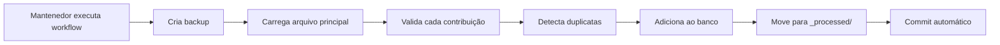

# 🤖 Guia de CI/CD - GitHub Actions

Este documento explica como funciona o sistema de CI/CD do projeto e como utilizá-lo.

## 🎯 Visão Geral

O projeto utiliza **GitHub Actions** para automatizar:
- ✅ Validação de contribuições
- 🚫 Prevenção de edições diretas em arquivos principais
- 🔄 Merge automático de contribuições
- 🧪 Testes de scripts Python
- 📊 Geração de estatísticas

---

## 🔍 Workflow 1: Validação de Contribuições

### Quando executa?
- Automaticamente em **todos os Pull Requests** que modificam arquivos em `data/contributions/`

### O que valida?
- ✅ JSON válido e bem formatado
- ✅ Todos os campos obrigatórios presentes
- ✅ Tipos de dados corretos
- ✅ Domínio válido para a certificação
- ✅ Dificuldade válida (easy/medium/hard)
- ✅ Tipo válido (multiple-choice/multiple-answer)
- ✅ Exatamente 4 opções de resposta
- ✅ Resposta correta dentro do range
- ✅ Tags relevantes (mínimo 2)
- ✅ Tamanho adequado de questão e explicação
- ✅ Informações do contribuidor completas

### Resultado

**✅ Se passar:**
```
✅ Validação de Contribuições Passou!

Todas as questões foram validadas com sucesso! 🎉

Arquivos validados:
- ✅ data/contributions/clf-c02/questao-s3.json

Próximos passos:
- ✅ Validação automática concluída
- 👀 Aguardando review de um mantenedor
```

**❌ Se falhar:**
```
❌ Validação de Contribuições Falhou

Algumas questões não passaram na validação automática.

Como corrigir:
1. Veja os logs acima para identificar os erros
2. Corrija localmente usando o validador
3. Faça commit das correções
```

---

## 🚫 Workflow 2: Prevenção de Edições Diretas

### Quando executa?
- Automaticamente em PRs que tentam editar:
  - `data/clf-c02.json`
  - `data/saa-c03.json`
  - `data/aif-c01.json`
  - `data/dva-c02.json`
  - `data/*-en.json`

### O que faz?
- 🚫 **Bloqueia o PR imediatamente**
- 💬 Comenta explicando o novo fluxo modular
- 📖 Fornece links para documentação

### Por que existe?
Evita conflitos de merge forçando o uso do sistema modular onde cada contribuidor cria seu próprio arquivo.

---

## 🔄 Workflow 3: Auto-Merge de Contribuições

### Quando executa?
- **Manualmente** pelos mantenedores

### Como executar?

1. **Vá para Actions no GitHub**
   ```
   https://github.com/SEU-USUARIO/projeto-simulados-certificacao-aws/actions
   ```

2. **Selecione "Auto-Merge Contributions"**

3. **Clique em "Run workflow"**

4. **Preencha os parâmetros:**
   - **Certification ID**: Escolha a certificação (clf-c02, saa-c03, etc.)
   - **Dry run**: Marque para testar sem fazer alterações

5. **Clique em "Run workflow"**

### O que acontece?



### Saída esperada

```
🔄 Mergeando contribuições para: clf-c02
============================================================
💾 Backup criado: clf-c02_backup_20260324_143022.json
📂 Arquivo principal carregado: 195 questões
📥 Contribuições encontradas: 3

🔍 Processando: questao-s3-versioning.json
   ✅ Mergeada com sucesso! Movida para _processed/

🔍 Processando: questao-iam-roles.json
   ✅ Mergeada com sucesso! Movida para _processed/

🔍 Processando: questao-ec2-duplicate.json
   ⚠️  Questão duplicada detectada. Pulando...

============================================================
📊 RESULTADOS DO MERGE
============================================================
✅ Questões mergeadas: 2
⚠️  Questões puladas: 1
❌ Erros: 0

💾 Arquivo principal atualizado: 197 questões totais
```

---

## 🧪 Workflow 4: Testes de Scripts Python

### Quando executa?
- Push ou PR que modifica scripts em `scripts_python/`

### O que testa?
- 🐍 Compatibilidade com Python 3.11 e 3.12
- 🔍 Linting com flake8
- ✅ Validador funciona corretamente
- ✅ Merger funciona em modo dry-run

---

## 📊 Workflow 5: Relatório de Estatísticas

### Quando executa?
- **Automaticamente**: Toda segunda-feira às 9h UTC
- **Manualmente**: Via workflow_dispatch

### O que faz?
1. Calcula estatísticas do projeto:
   - Total de questões por certificação
   - Questões de múltipla resposta
   - Contribuições pendentes

2. Atualiza badges no README

3. Cria issue semanal com relatório:
   ```markdown
   ## 📊 Estatísticas do Projeto - 2026-03-24
   
   ### 📚 Banco de Questões
   
   | Certificação | Total | Múltipla Resposta | Pendentes |
   |--------------|-------|-------------------|-----------|
   | CLF-C02 | 195 | 5 | 3 |
   | SAA-C03 | 195 | 0 | 1 |
   | AIF-C01 | 143 | 5 | 0 |
   | DVA-C02 | 195 | 0 | 2 |
   | TOTAL | 728 | 10 | 6 |
   ```

---

## 🔧 Configuração para Mantenedores

### Permissões Necessárias

Os workflows precisam das seguintes permissões:

```yaml
permissions:
  contents: write      # Para fazer commits
  pull-requests: write # Para comentar em PRs
  issues: write        # Para criar issues
```

### Secrets Necessários

Nenhum secret adicional é necessário! Os workflows usam apenas `GITHUB_TOKEN` que é fornecido automaticamente.

### Branch Protection Rules (Recomendado)

Configure regras de proteção na branch `main`:

1. **Vá para Settings → Branches → Add rule**

2. **Configure:**
   - Branch name pattern: `main`
   - ✅ Require status checks to pass before merging
   - ✅ Require branches to be up to date before merging
   - Status checks required:
     - `Validate Question Files`
     - `Block Direct Edits to Main Files`

3. **Salve as regras**

---

## 🐛 Troubleshooting

### Workflow não executa

**Problema**: Workflow não aparece na aba Actions

**Solução**:
1. Verifique se o arquivo está em `.github/workflows/`
2. Verifique sintaxe YAML (use [YAML Lint](https://www.yamllint.com/))
3. Faça push para a branch correta

### Validação falha mas questão parece correta

**Problema**: Validador reporta erro mas questão está OK

**Solução**:
1. Execute validador localmente:
   ```bash
   python scripts_python/validate_contribution.py data/contributions/clf-c02/sua-questao.json
   ```
2. Veja o erro específico
3. Compare com o template

### Auto-merge não encontra contribuições

**Problema**: Workflow diz "0 contribuições encontradas"

**Solução**:
1. Verifique se arquivos estão em `data/contributions/<cert-id>/`
2. Verifique se não começam com `_` (reservado para templates)
3. Verifique se não estão em `_processed/`

---

## 📚 Recursos Adicionais

- [GitHub Actions Documentation](https://docs.github.com/en/actions)
- [Workflow Syntax](https://docs.github.com/en/actions/using-workflows/workflow-syntax-for-github-actions)
- [GitHub Script Action](https://github.com/actions/github-script)
- [Changed Files Action](https://github.com/tj-actions/changed-files)

---

## 🎯 Próximos Passos

Depois de configurar o CI/CD:

1. **Teste os workflows**:
   - Abra um PR de teste com uma questão
   - Veja a validação automática funcionar
   - Tente editar um arquivo principal e veja o bloqueio

2. **Configure branch protection**:
   - Proteja a branch `main`
   - Exija validação antes de merge

3. **Documente para a equipe**:
   - Compartilhe este guia
   - Treine novos contribuidores

---

<div align="center">

**CI/CD configurado com sucesso! 🎉**

*Agora o projeto escala com qualidade garantida!*

</div>
